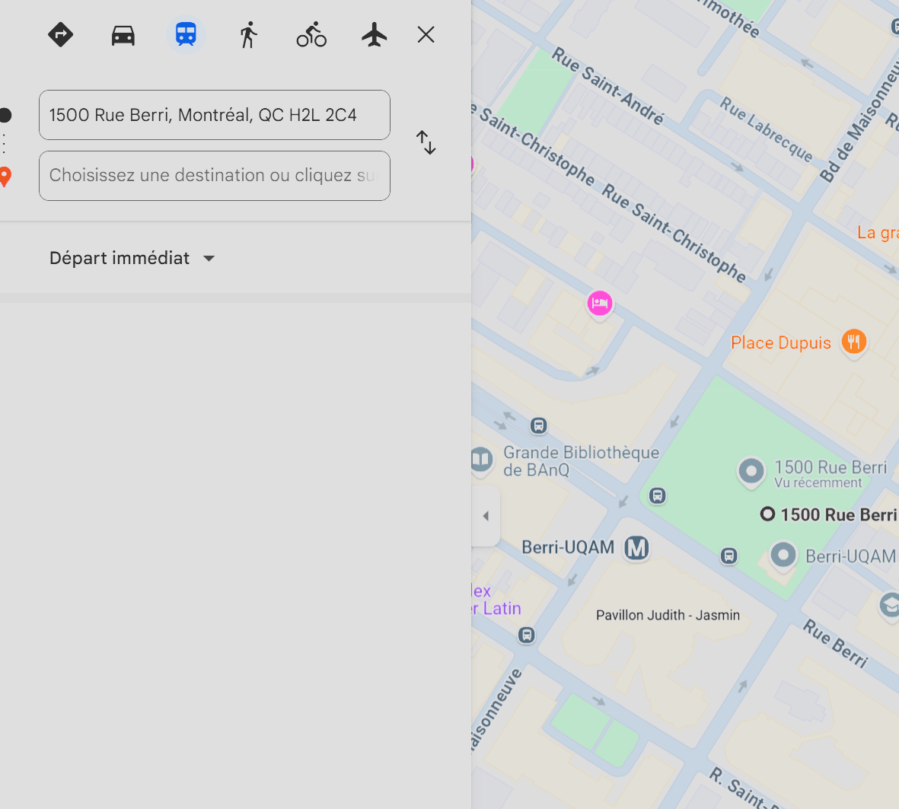
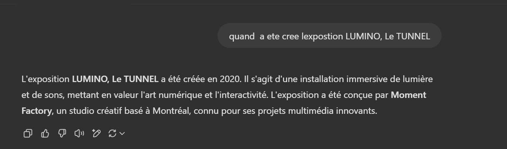
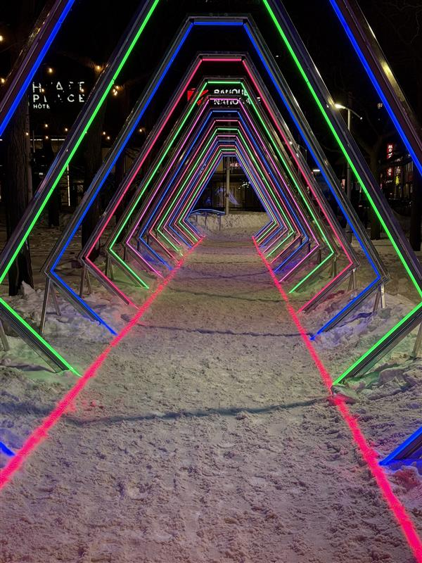
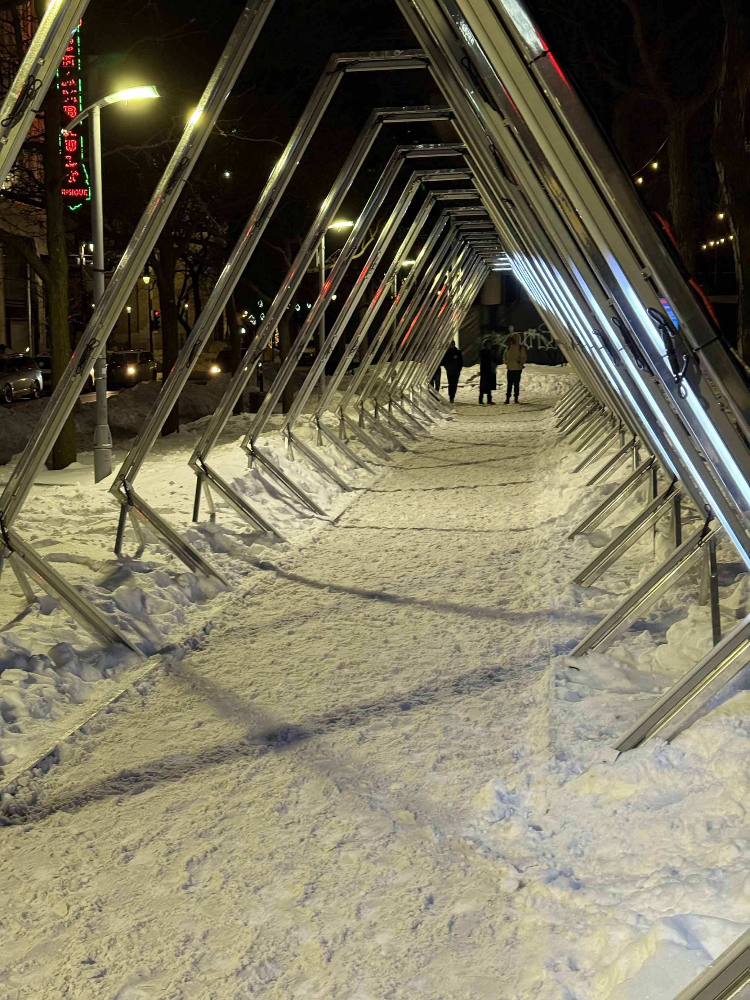
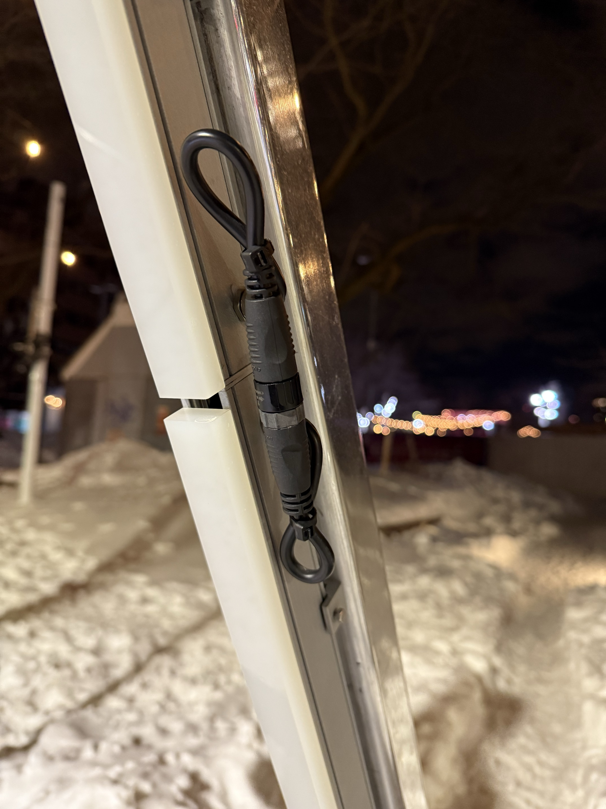
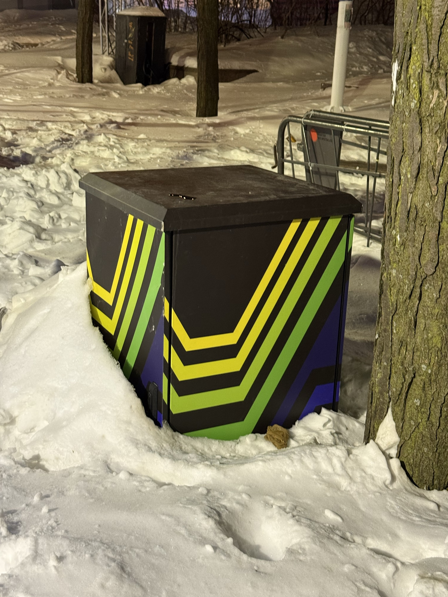
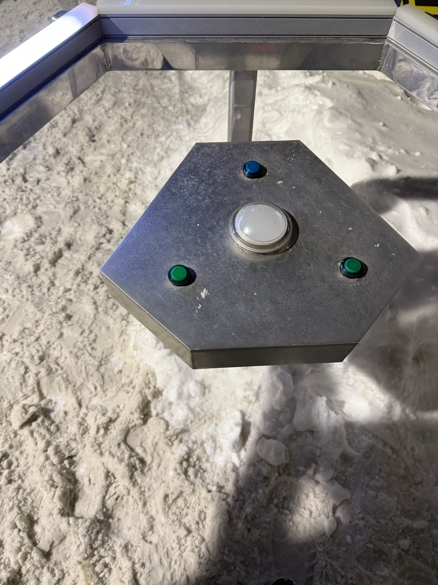
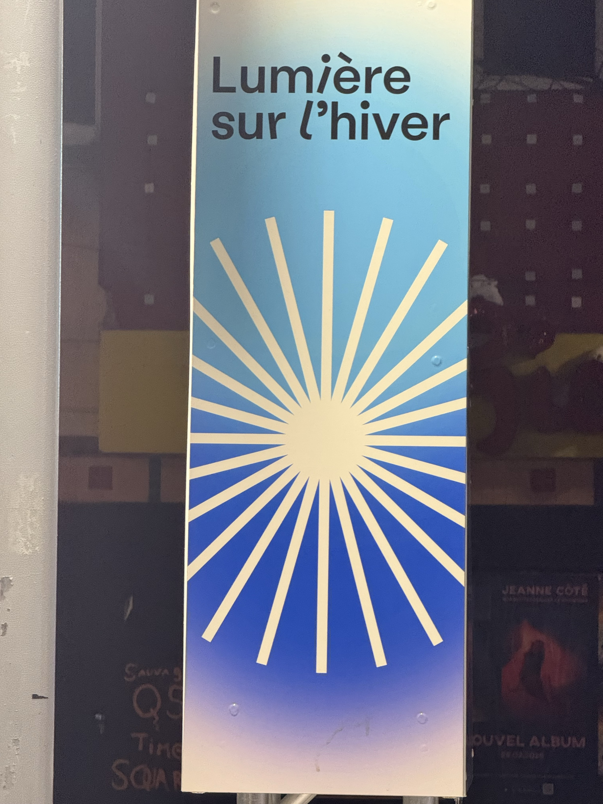

CONSIGNES: https://github.com/SylvieFrancois/H25_TIM_exposition/blob/main/consignes/banque_inspiration/TP_tous_documentation.md

# Nom de l'exposition ou de l'événement
 ### Le nom de l'exposition se nomme *le tunnel*
 

# Lieu de mise en exposition
### l'exposition 'le tunnel' se situe a : **Place Émilie-Gamelin, 1500 Rue Berri, Montréal, QC H2L 2C4**

 

# Type d'exposition (temporaire, permanente, itinérante, intérieure, extérieure)
### L'exposition *le tunnel* est une expostion temporaire extérieure qui se deroule du **16 janvier au 9 mars 2025**
##### sources: https://www.luminomtl.com/fr/activites/oeuvres-exterieures/le-tunnel
 

# Date de votre visite
### je suis allé visité cette exposition **le 23 févrrier 2025 a 20:00** 
 

# Titre de l'oeuvre ou du dispositif
### l'oeuvre ce nomme **le tunnel et est organisée par LUMINO**
 

# Nom de l'artiste ou de la firme
  ### - Les artistes de Conception et création sont **BIG ART**
  ### - les Producteur de tournée sont **Creos**
  ### - Le tunnel est presentée par le QUARTIER DES SPECTACLES PARTNERSHIP
##### sources: https://www.luminomtl.com/fr/activites/oeuvres-exterieures/le-tunnel
 

# Année de réalisation
### Le site officiel de LUMINO ne montrais pas linformation donc jai demander a ChatGPT 

 

# Description de l'oeuvre ou du dispositif
### Le TUNNEL est une installation au fini poli qui reflète le paysage urbain environnant. Constituée d’une série de 16 structures cosmiques insolites d’une hauteur 4 mètres parées de plus de 150 barres de diodes électroluminescentes (DEL), elle vous attire dans un tourbillon de lumière de 30 mètres qui vous fait passer dans une autre dimension. Grâce à sa console interactive personnalisée, vous pouvez aussi prendre le contrôle de l’expérience des autres visiteurs. Chaque touche vous permet de personnaliser des aspects de la programmation lumineuse, comme la vitesse, la couleur, le fondu et les motifs, pour créer un monde parallèle unique. L’installation est également dotée d’un mode « auto-pilote » qui permet d’en prolonger l’expérience !
##### sources: https://www.luminomtl.com/fr/activites/oeuvres-exterieures/le-tunnel
 

# Type d'installation (contemplative, immersive, interactive)
### Le tunnel est une installation immersive et interactive. Elle utilise des jeux de lumière, des projections, des effets sonores et des éléments numériques pour créer une expérience sensorielle unique. Les visiteurs peuvent interagir avec l'environnement, modifiant ainsi certains aspects de l'installation en fonction de leurs actions. L'objectif est d'offrir une expérience immersive, tout en stimulant la réflexion et la créativité
 

# Fonction du dispositif multimédia
### Le tunnel a plusieur fonction principale, par example :
### 1- Création d'un espace immersif : Le tunnel, souvent caractérisé par des projections lumineuses et sonores qui évoluent, transforme l'environnement physique en un espace virtuel qui entoure totalement le spectateur. L'usage de la lumière et du son crée une atmosphère dynamique, où l'artiste manipule l’espace à travers les technologies multimédia.
 

### 2- Interaction avec le spectateur : Le dispositif multimédia intègre souvent des éléments interactifs où les mouvements ou les actions des spectateurs influencent l’évolution des projections et des sons. Par exemple, un spectateur pourrait modifier la couleur, la forme ou la vitesse des projections en fonction de son interaction avec le tunnel, augmentant ainsi l'expérience sensorielle.
 

### 3- Conception d'un voyage sensoriel : Le tunnel est conçu pour guider les spectateurs dans une expérience de transformation visuelle et sonore. Il fonctionne comme un passage entre différentes ambiances ou états d'esprit, stimulant une perception sensorielle intense, où chaque étape du tunnel offre une nouvelle dimension d'interaction.
 

### 4- Exploration de l’espace et du temps : Le dispositif multimédia dans le tunnel permet de manipuler les éléments de temps et d’espace, créant un environnement évolutif où les perceptions du spectateur sont constamment sollicitées. Les changements lumineux et sonores peuvent simuler un passage dans un autre monde ou une immersion dans un rêve.
 

### **En résumé**, Le TUNNEL dans LUMINO sert de support sensoriel et interactif, permettant de vivre une expérience immersive où les limites entre l'art, la technologie et le spectateur deviennent floues, tout en invitant à une exploration continue et personnalisée de l'œuvre.
 

# Mise en espace
### pour le Tunnel, ils y avaiss;
 

### - 16 structures cosmiques insolites d’une hauteur 4 mètres parées de plus de 150 barres de diodes électroluminescentes (DEL)

 

### - Des fils électriques

 

### - une boite electrique

 

### - une surface avec des bouton servant a controller les lumières

 

### - un panneau avec le nom desus 

