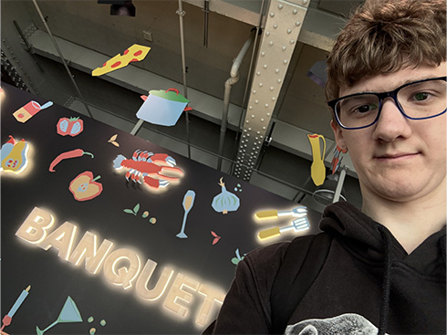
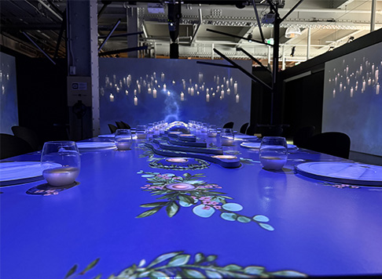

LIEN POUR CONSIGNE: https://github.com/SylvieFrancois/H25_TIM_exposition/blob/main/consignes/banque_inspiration/TP01_expo_centre_des_sciences.md

## Nom de l'exposition ou de l'événement
Banquet

## une photo de moi devant l'Exposition 

## type dexposition 
Temporaire

## date de votre visite 
vendredi 31 janvier 2025

## Titre du dispositif choisi
Spectacle

## Nom de la firme (texte de présentation ou explicatif)

## Année de réalisation 
*info non trouver*

## Type d'installation (contemplative, immersive, interactive)
- immersive

## Mise en espace

## Composantes et techniques
- 3 mur avec de la projection
- 1 table avec une projection
- 4 arbre de couleur qui suivent le rhytme
- 3 projecteur sous la table, 2 projecteur sur les cote

## Éléments nécessaires à la mise en exposition

## Description de l'oeuvre
Je vous raconte mon expérience lors de l'exposition Banquet que j'ai visitée le vendredi 31 janvier 2025. C'était une expo temporaire, et j'ai même pris une photo devant l'entrée pour me souvenir de ce moment.

Parmi toutes les installations, celle qui m'a le plus marqué s'appelle Spectacle. C'est une installation immersive qui joue avec la lumière et les images. Voici ce que j'ai pu voir :

Trois murs avec des projections : Les images changeaient tout le temps, ce qui rendait l'ambiance vraiment vivante.
Une table avec une projection : La table diffusait aussi des images, ajoutant une touche originale à l'ensemble.
Quatre arbres de couleur : Ces arbres suivaient un rythme, créant un mouvement harmonieux dans l'espace.
Projecteurs : Il y avait trois projecteurs placés sous la table et deux sur les côtés, ce qui contribuait à une ambiance lumineuse très particulière.
Cette installation m'a permis de vivre un véritable banquet des sens. J'ai beaucoup apprécié la manière dont la technologie et l'art se sont mélangés pour offrir une expérience simple, mais marquante.
