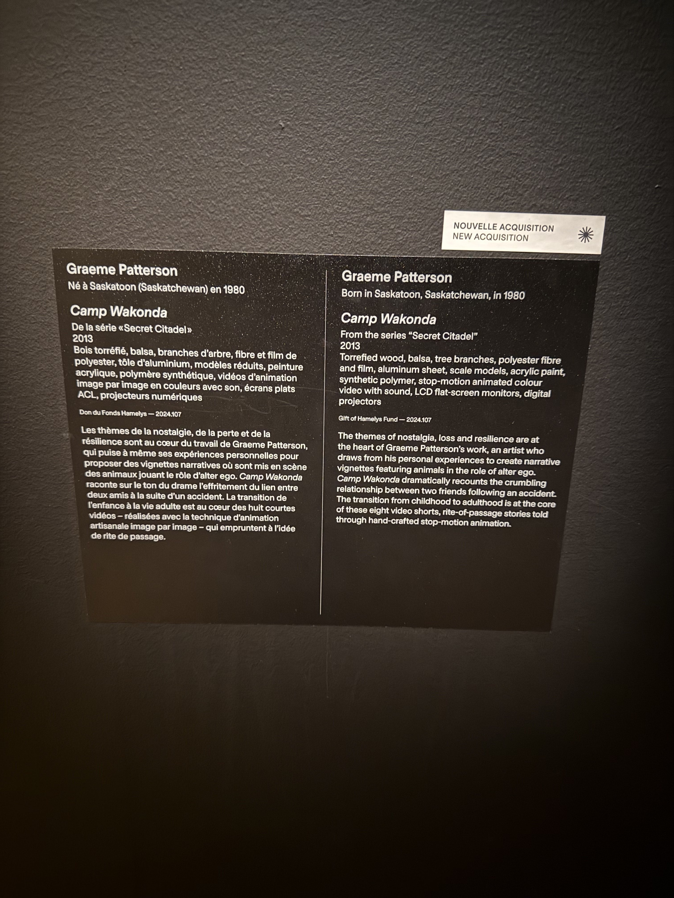
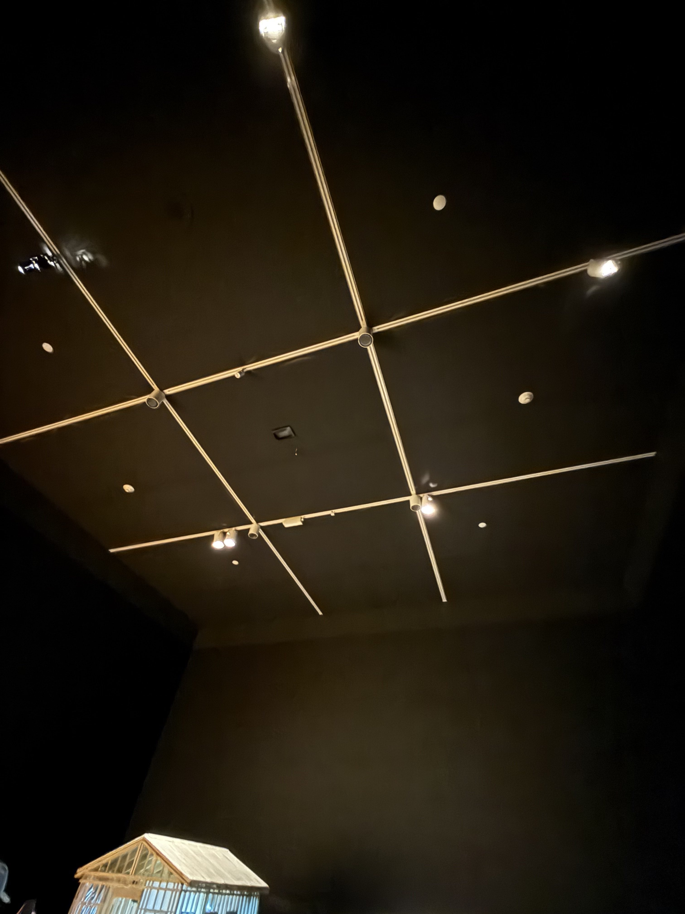

## Nom de l'exposition ou de l'événement
L'exposition s'appelle **Camp Wakonda**.

## Lieu
**Musée des beaux-arts de Montréal**

## Une photo de moi devant l’exposition  

## Type d'exposition  
**Camp Wakonda** est une **exposition temporaire**.

## Date de ma visite  
Je suis allé(e) le **vendredi 4 janvier 2025**.

## Titre du dispositif choisi  
Le nom du dispositif choisi est **Camp Wakonda**.

## Nom de la firme (texte de présentation ou explicatif)  
  

## Année de réalisation  
L'œuvre **Camp Wakonda** a été créée en **2013**.

## Type d'installation (contemplative, immersive, interactive)  
L'installation est **immersive**.

## Mise en espace  

  

## Composantes et techniques  
Les composants techniques de l’installation sont :  
- **4 murs**  
- **2 lits avec projection**  
- **6 haut-parleurs autour de la pièce**  
- **2 projecteurs**    

## Éléments nécessaires à la mise en exposition  
Les éléments nécessaires à la mise en exposition étaient une **bande sonore**, des **haut-parleurs**, des **lits**, et un **petit projecteur**.

## Expérience vécue  
Je vais vous raconter mon expérience lors de l'exposition au **Musée des beaux-arts de Montréal**.  
J'ai bien aimé cette exposition. L'univers était beau, les décors et le son étaient bien mélangés, formant une très belle représentation sonore et visuelle avec plein de petits détails cachés.

## Description de l'œuvre  
L'exposition s'appelle **Camp Wakonda**, et elle a eu lieu au **Musée des beaux-arts de Montréal**. Je suis allé(e) la visiter le **vendredi 4 janvier 2025**. Cette exposition temporaire était immersive, avec un dispositif portant également le nom **Camp Wakonda**. L'œuvre a été créée en **2017**. L'installation comportait **4 murs**, **2 lits avec projection**, **6 haut-parleurs** répartis autour de la pièce, et **2 projecteurs**. Elle nécessitait une **bande sonore**, des **haut-parleurs**, des **lits**, et un **petit projecteur** pour sa mise en exposition.

