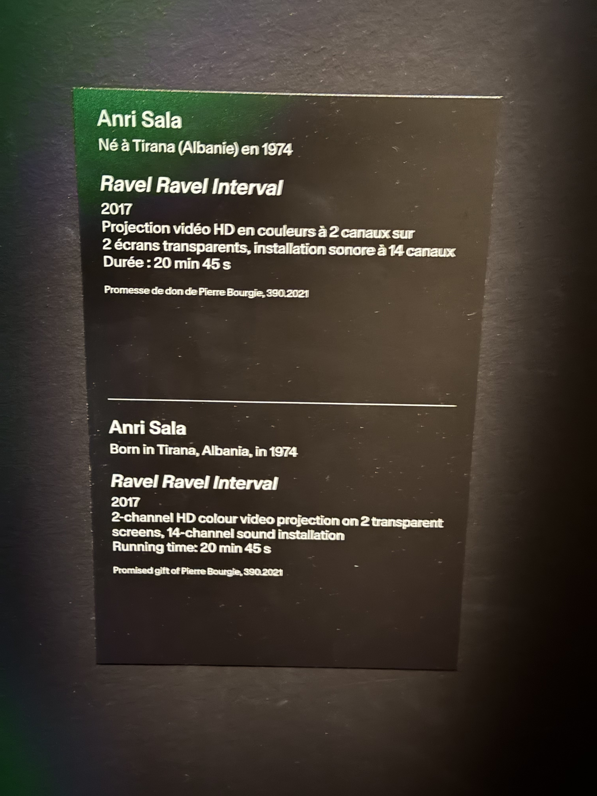

## Nom de l'exposition ou de l'événement
### L'oeuvre s'intitule **Ravel Ravel Interval**.

#### FICHE DU NOM DE L'OEUVRE, PRISE PAR XAVIER MARTINEAU

## Lieux
### MUSÉE DES BEAUX-ARTS DE MONTRÉAL

#### PHOTO DE L'AUTEUR DEVANT LA PHOTO, PRISE PAR XAVIER MARTINEAU
## Type d'exposition  
### **Ravel Ravel Interval** est une **exposition temporaire**.

## Date de ma visite  
### Je suis allé le **vendredi 4 janvier 2025**.

## Titre du dispositif choisi  
### Le nom du dispositif choisi est **Ravel Ravel Interval**.

## Nom de la firme (texte de présentation ou explicatif)  
  
###### FEUILLE DES CRÉDITS, PRISE PAR XAVIER MARTINEAU

###### PANNEAU DE DESCRIPTION DE L'OEUVRE, PRISE PAR XAVIER MARTINEAU

## Année de réalisation  
### L'œuvre **Ravel Ravel Interval** a été créée en **2017**.

## Type d'installation (contemplative, immersive, interactive)  
### L'installation est **immersive** mais aussii **contemplative**.

## Mise en espace  
### Ravel Ravel mise en espace:"https://youtube.com/shorts/_RUQk8doMbc?si=9pO_4kqyjMoeDQmx"

## Composantes et techniques  
### Les composants techniques de l’installation sont :  
### A) **Le film video**
### C) **14 haut-parleurs autour de la pièce**  
### D) **les 14 pistes sonores**  

## Éléments nécessaires à la mise en exposition  
### Les éléments nécessaires à la mise en exposition étaient des bancs, des toiles géantes semi transparente, des projecteurs, une bande sonore et des haut-parleurs.

## Expérience vécue  
### Je vais vous raconter mon expérience lors de l'exposition au **Musée des beaux-arts de Montréal**.  
### J’ai beaucoup apprécié cette exposition. C’était à la fois magnifique, harmonieux et rempli de chaleur. J’ai pu ressentir toute la tristesse transmise par la musique et le piano, ### portée par le rythme qui me touchait.

## Description de l'œuvre

### Le **vendredi 4 avril 2025**, je me suis rendu au **Musée des beaux-arts de Montréal** pour visiter l’exposition temporaire **Ravel Ravel Interval**. Cette œuvre immersive, réalisée en **2017**, m’a profondément marqué.

### Dès mon arrivé, j’ai été impressionné par la mise en espace de l’installation. Entouré de **quatre murs**, je me suis retrouvé au cœur d’un dispositif audiovisuel comprenant **deux gros écrans** diffusant des projections vidéo, **deux projecteurs**, **un banc** pour l’observation, et surtout, **quatorze haut-parleurs** répartis tout autour de la pièce. L’ambiance sonore enveloppante, combinée aux images, créait une atmosphère saisissante.

### Le dispositif s’intitule également **Ravel Ravel Interval**, un nom énigmatique mais évocateur, qui donne le ton à l'expérience. La présentation était accompagnée de panneaux explicatifs sur les artistes et la firme impliquée dans la conception de l’œuvre, ce qui ajoutait une touche de compréhension intéressante.

### Ce que j’ai le plus apprécié, c’est la façon dont la musique et le piano transmettaient une **profonde tristesse**, rendue encore plus puissante par le **rythme** et l’environnement immersif. C’était **magnifique**, **harmonieux** et **plein de chaleur**. J’ai vraiment senti l’émotion me traverser, comme si chaque note résonnait directement en moi.
