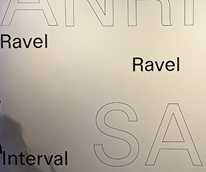

## Nom de l'exposition ou de l'événement
L'exposition ce nommme Ravel Ravel Intervalle

## une photo de moi devant l'Exposition 

## type dexposition 
Ravel Ravel Intervalle est une exposition Temporaire

## date de votre visite 
Je suis aller le vendredi 4 janvier 2025

## Titre du dispositif choisi
Le nom du diapositif choisi ce nomme Ravel Ravel Intervalle

## Nom de la firme (texte de présentation ou explicatif)

## Année de réalisation 
L'oeuvre Ravel Ravel Intervalle a été crée en 2017

## Type d'installation (contemplative, immersive, interactive)
Le type dinstalation est immersive

## Mise en espace

## Composantes et techniques
Les composant technique que nous avon etais  
1) **4 murs***
2) **2 tv avec une projection**
3) **4 arbre de couleur qui suivent le rhytme**,**3 projecteur au dessus de la table et 2 sur les coté** . 

## Éléments nécessaires à la mise en exposition
les élément nécesaire etais une table, des fil, une bande sonore, de lanimation

## Description de l'oeuvre
Je vous raconte mon expérience lors de l'exposition Banquet

J'ai visité l'exposition Banquet le vendredi 31 janvier 2025, une exposition temporaire qui m'a profondément marqué. Lors de ma visite, j'ai pris une photo devant l'entrée pour garder un souvenir de ce moment.

Parmi toutes les installations, celle qui a retenu mon attention s'appelle Spectacle. C'est une installation immersive, qui joue habilement avec la lumière, l'espace et le rythme. Ce dispositif comprenait plusieurs éléments fascinants. Tout d'abord, il y avait trois murs avec des projections, qui diffusaient des images changeantes, créant une atmosphère vivante et dynamique. Ensuite, une table avec une projection apportait une dimension interactive, diffusant des images en mouvement, ajoutant une touche originale à l'ensemble.

L'élément qui m'a particulièrement impressionné était les quatre arbres de couleur, qui semblaient suivre un rythme, apportant de la fluidité et du mouvement à l'espace. Les projecteurs, trois au-dessus de la table et deux sur les côtés, contribuaient à l'ambiance lumineuse, accentuant l'effet immersif de l'installation. Cette mise en scène technologique et artistique m'a permis de vivre un véritable "banquet des sens", où l'art et la technologie se rencontrent pour offrir une expérience simple, mais très marquante.

L'installation était immersive, ce qui m'a permis de m'immerger totalement dans l'environnement. L'usage de la lumière, des projections et du son, combiné à l'interactivité des éléments, créait une expérience sensorielle unique et mémorable. C'est une installation qui transforme l'espace et invite les visiteurs à s'engager activement avec l'œuvre.
