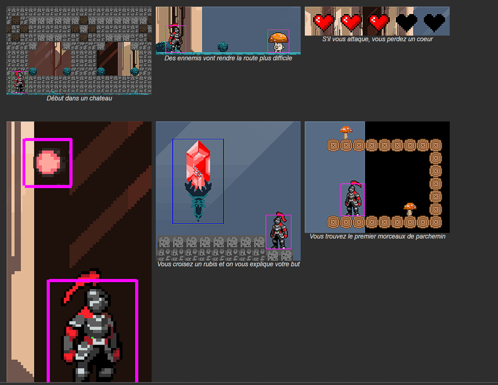
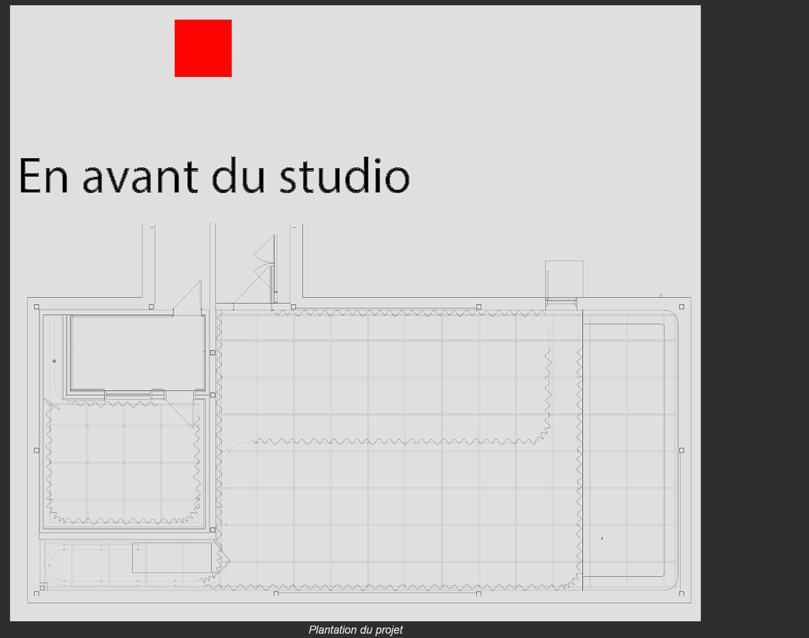
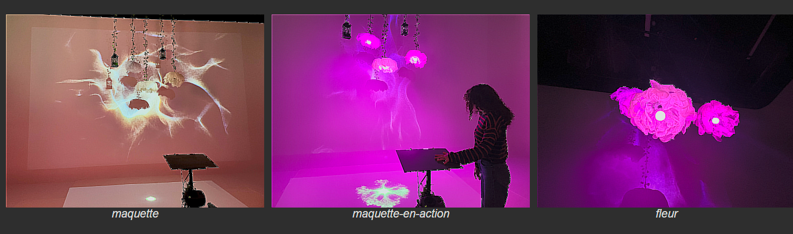
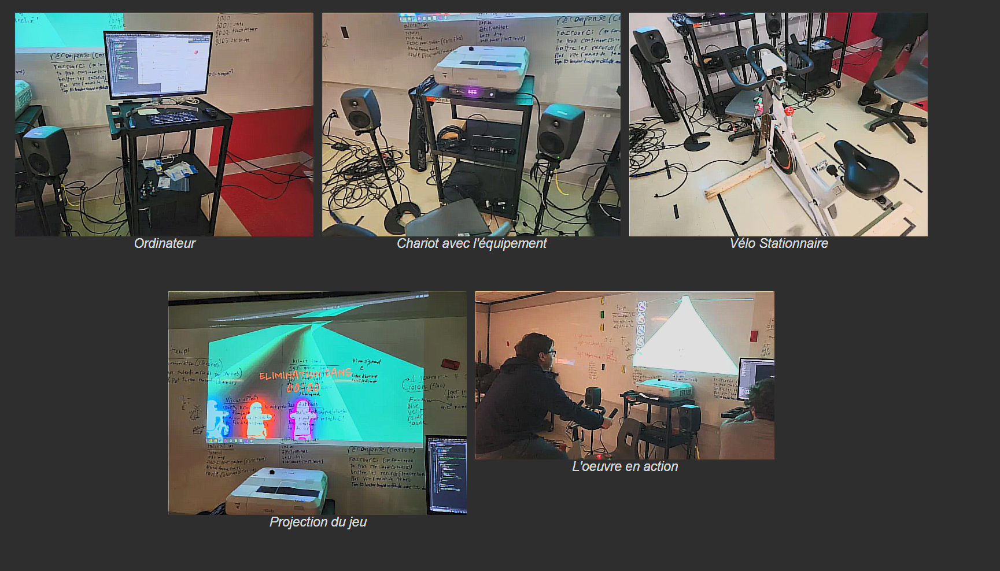

# tous les projet 
## Notes projets
### 01- Internature  
 

### 02-prismatica  
#### les membres
A) Vincent Delisle  
B) Ikrame Rata  
C) Jérémy Duverseau  
#### image du projet

###### SOURCES :https://pootpookies.github.io/Prismatica/#/40_maquette/ 
#### maquette projet
[📽 Regarder la video de prismatica](https://youtu.be/DIQUb2jYALk)
###### SOURCES https://pootpookies.github.io/Prismatica/#/30_production/60_plantation/
#### mon ressenti
J’ai aimé cette exposition, car elle était visuellement captivante et bien conçue, offrant une expérience enrichissante à découvrir.
#### 3 cours besoin
A) interactivité ludique  
B) Design graphique  
C) audiovisuel  
#### technique ou composante non aquis
Aucune   
 

### 03-arcadia  
#### les membres
A) Dominic Yale  
B) William Beauvais  
C) Anton Nikulin  
#### image du projet

###### SOURCES https://cousi-cousa.github.io/Arcadia/#/40_maquette/?id=jeu 
#### maquette projet

###### SOURCES https://cousi-cousa.github.io/Arcadia/#/30_production/60_plantation/
#### mon ressenti
J'ai bien aimé ce petit jeu vidéo, rempli de détails, mais quelques petits soucis ici et là ont légèrement réduit mon appréciation.
#### 3 cours besoin
A) Animation 2D  
B) Audio 1/2  
C) audiovisuel  
#### technique ou composante non aquis
Rien  
 

### 04-Etheria  
#### les membres
A) Joshua Gonzalez-Barrera   
B) Victor Gileau  
C) Michael Un Dupré  
D) Pierre-Luc Proulx  
E) Maik Hamel  
#### image du projet
[📽 Regarder la video](https://youtu.be/GQIxuZGOXwk)  
#### maquette projet

###### SOURCES :https://pootpookies.github.io/Prismatica/#/40_maquette/ 
#### mon ressenti
J’ai bien aimé découvrir le projet de ces étudiants, très créatif et original, qui sort de l’ordinaire.
#### 3 cours besoin
A) Objets interactifs  
B) Audio 1/2  
C) audiovisuel  
#### technique ou composante non aquis
Creation de jeu avec unity  
 

### 05-luminatura  
#### les membres
A) audrey   
B) justine  
C) Camilia  
D) Prethiah  
E) Ihab  
#### image du projet
  
#### maquette projet
[📽 Regarder la video](https://youtu.be/XiKaz-DwWxc?si=ifbxIp7DJino87Fp)
###### SOURCES https://miaou-mafia.github.io/projet-luminatura/#/30_production/60_plantation/

#### mon ressenti
Quand je suis aller le projet ne fonctionais pas donc je nai pas pu vraiment tester
#### 3 cours besoin
A) Objets interactifs  
B) Audio 1/2  
C) audiovisuel  
#### technique ou composante non aquis
Creation de son avec arduino  
 

### 06-c0ndu8  
#### les membres
A) Ian_Corbin  
B) Samuel_Desmeules_Voyer  
C) Alexandre_Gervais  
D) Kevin_Malric   
E) Jérémy_Roy_Coté  
#### image du projet
 
#### maquette projet

#### mon ressenti
Très intéressant ! C’était impressionnant de voir le souci du détail et le temps investi pour réaliser ce projet.
#### 3 cours besoin
A) Objets interactifs  
B) Audio 1/2  
C) audiovisuel  
#### technique ou composante non aquis
Creation de son avec arduino/jeu en unity  
 

### 07-Fuga  
#### les membres
A) Matis  
B) Tristan  
C) Daniel  
D) Abdel   
E) Yavuz  
#### image du projet
Je n’ai pas trouvé d’image du projet et je n’ai pas pris de vidéo, alors j’inclus le scénarimage.
[📽 Regarder la video](https://youtu.be/xKefpLbpBwk) 
#### maquette projet

#### mon ressenti
J’ai vraiment apprécié la possibilité de personnaliser la forme et la couleur de l’arbre en le faisant grandir, ce qui rendait l’expérience immersive et créative.
#### 3 cours besoin
A) Objets interactif  
B) Audio 1/2  
C) audiovisuel  
#### technique ou composante non aquis
Creation de son avec arduino/jeu en unity  

