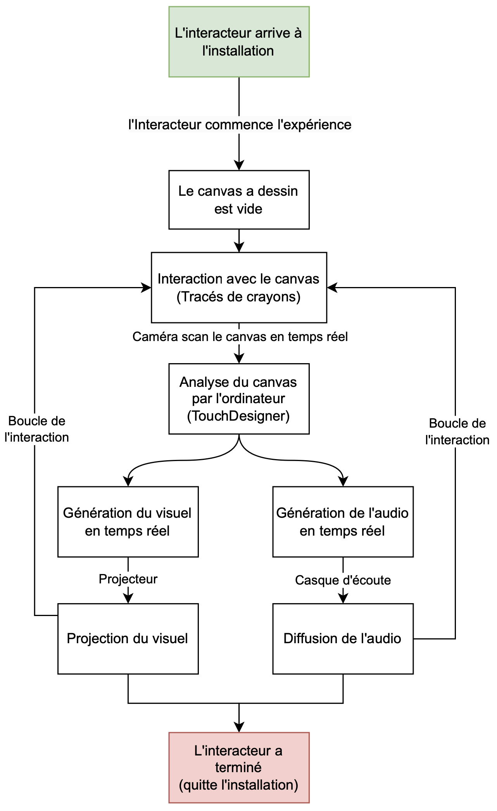

# tous les projet 
## Notes projets
### 01- Internature  

### 02-prismatica  
#### les membres
A) Vincent Delisle  
B) Ikrame Rata  
C) Jérémy Duverseau  
#### image du projet

#### maquette projet

#### mon ressenti
jai aimer cette exposition car cetais une belle expo a voir
#### 3 cours besoin
A) interactivité ludique  
B) Design graphique  
C) audiovisuel  
#### technique ou composante non aquis
rien  

### 03-arcadia  
#### les membres
A) Dominic Yale  
B) William Beauvais  
C) Anton Nikulin  
#### image du projet

#### maquette projet
**Aucune maquette trouvé lors de la redaction**
#### mon ressenti
J'ai bien aimé ce petit jeu video mais rempli de details, mais quelque petit soucis par ci par la mon fais moin aprécié
#### 3 cours besoin
A) Animation 2D  
B) Audio 1/2  
C) audiovisuel  
#### technique ou composante non aquis
Rien  

### 04-Etheria  
#### les membres
A) Joshua Gonzalez-Barrera   
B) Victor Gileau  
C) Michael Un Dupré  
D) Pierre-Luc Proulx  
E) Maik Hamel  
#### image du projet
[📽 Regarder la video](https://youtu.be/GQIxuZGOXwk)  
#### maquette projet
[📽 Regarder la video](https://youtu.be/GQIxuZGOXwk)
#### mon ressenti
Jai bien aimé de voir le projet de ces étudiants, très créatif et qui sors de l'ordinaire
#### 3 cours besoin
A) Objets interactifs  
B) Audio 1/2  
C) audiovisuel  
#### technique ou composante non aquis
Creation de jeu avec unity  

### 05-luminatura  
#### les membres
A) audrey   
B) justine  
C) Camilia  
D) Prethiah  
E) Ihab  
#### image du projet
  
#### maquette projet
[📽 Regarder la video](https://www.youtube.com/watch?v=9Ty8B9qVx1c)
[📽 Regarder la video](https://www.youtube.com/watch?v=_t8blyjZfRY))

#### mon ressenti
Quand je suis aller le projet ne fonctionais pas donc je nai pas pu vraiment tester
#### 3 cours besoin
A) Objets interactifs  
B) Audio 1/2  
C) audiovisuel  
#### technique ou composante non aquis
Creation de son avec arduino  

### 06-c0ndu8  
#### les membres
A) Ian_Corbin  
B) Samuel_Desmeules_Voyer  
C) Alexandre_Gervais  
D) Kevin_Malric   
E) Jérémy_Roy_Coté  
#### image du projet
 
#### maquette projet
[📽 Regarder la video](https://www.youtube.com/watch?v=z30DYRxXN6c)
#### mon ressenti
Tres interessant, cetais beau a voir le nombre de details et de temmps passé pour realisé se projet la
#### 3 cours besoin
A) Objets interactifs  
B) Audio 1/2  
C) audiovisuel  
#### technique ou composante non aquis
Creation de son avec arduino/jeu en unity  

### 07-Fuga  
#### les membres
A) Matis  
B) Tristan  
C) Daniel  
D) Abdel   
E) Yavuz  
#### image du projet
Jai pas trouvé dimage du projet et je nai pas pris de video alors jinclus le scénarimage
[📽 Regarder la video](https://youtu.be/xKefpLbpBwk) 
#### maquette projet
**Aucune image de maquette incluse lors de la redaction**
#### mon ressenti
Jai bien aimé pouvoir changer la facon et la couleur de larbre que je faisais grandir
#### 3 cours besoin
A) Objets interactif  
B) Audio 1/2  
C) audiovisuel  
#### technique ou composante non aquis
Creation de son avec arduino/jeu en unity  

