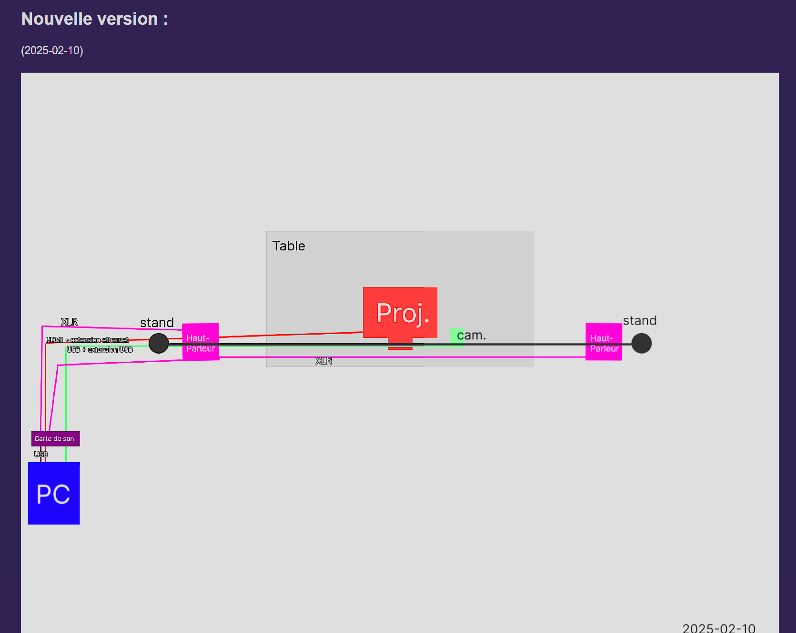
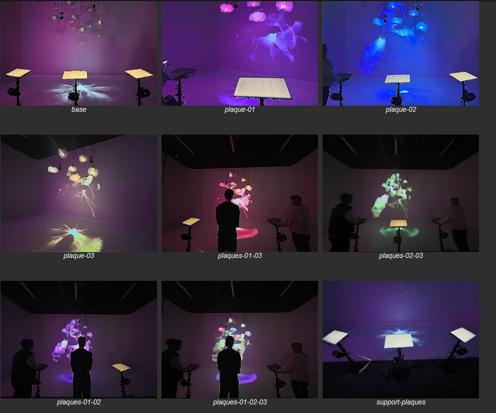
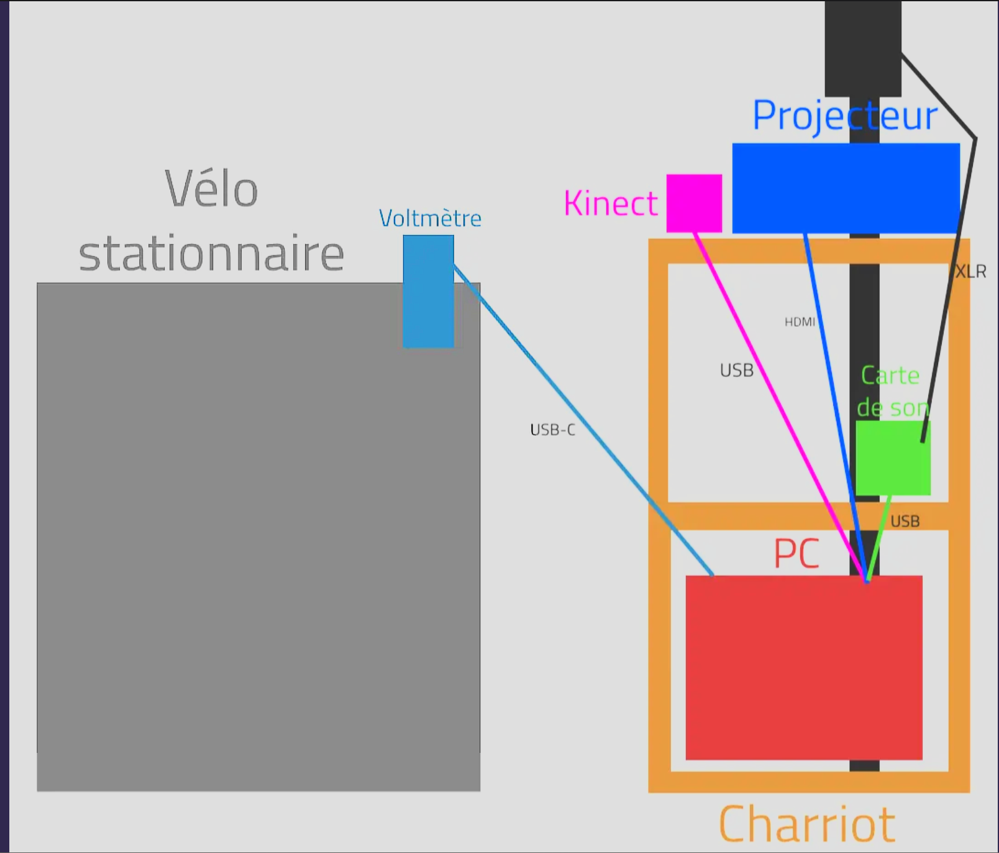

# Tous les projets

## Notes projets

### 01- Internature  
 

### 02- Prismatica  
#### Les membres
A) Vincent Delisle  
B) Ikrame Rata  
C) Jérémy Duverseau  

#### Image du projet  
  
###### SOURCES : [https://pootpookies.github.io/Prismatica/#/40_maquette/](https://pootpookies.github.io/Prismatica/#/40_maquette/)  

#### Maquette projet  
[📽 Regarder la vidéo de Prismatica](https://youtu.be/DIQUb2jYALk)  
###### SOURCES : [https://pootpookies.github.io/Prismatica/#/30_production/60_plantation/](https://pootpookies.github.io/Prismatica/#/30_production/60_plantation/)  

#### Mon ressenti  
J’ai aimé cette exposition, car elle était visuellement captivante et bien conçue, offrant une expérience enrichissante à découvrir.  

#### 3 cours nécessaires  
A) Interactivité ludique  
B) Design graphique  
C) Audiovisuel  

#### Technique ou composante non acquise  
Aucune technique ou composante non acquise.  
 

### 03- Arcadia  
#### Les membres
A) Dominic Yale  
B) William Beauvais  
C) Anton Nikulin  

#### Image du projet  
  
###### SOURCES : [https://cousi-cousa.github.io/Arcadia/#/40_maquette/?id=jeu](https://cousi-cousa.github.io/Arcadia/#/40_maquette/?id=jeu)  

#### Maquette projet  
  
###### SOURCES : [https://cousi-cousa.github.io/Arcadia/#/30_production/60_plantation/](https://cousi-cousa.github.io/Arcadia/#/30_production/60_plantation/)  

#### Mon ressenti  
J'ai bien aimé ce petit jeu vidéo, rempli de détails, mais quelques petits soucis ici et là ont légèrement réduit mon appréciation.  

#### 3 cours nécessaires  
A) Animation 2D  
B) Audio 1/2  
C) Audiovisuel  

#### Technique ou composante non acquise  
Aucune technique ou composante non acquise.  
 

### 04- Etheria  
#### Les membres
A) Joshua Gonzalez-Barrera  
B) Victor Gileau  
C) Michael Un Dupré  
D) Pierre-Luc Proulx  
E) Maik Hamel  

#### Image du projet  
[📽 Regarder la vidéo de Etheria](https://youtu.be/GQIxuZGOXwk)  

#### Maquette projet  
  
###### SOURCES : [https://pootpookies.github.io/Prismatica/#/30_production/60_plantation/](https://pootpookies.github.io/Prismatica/#/30_production/60_plantation/)  

#### Mon ressenti  
J’ai bien aimé découvrir le projet de ces étudiants, très créatif et original, qui sort de l’ordinaire.  

#### 3 cours nécessaires  
A) Objets interactifs  
B) Audio 1/2  
C) Audiovisuel  

#### Technique ou composante non acquise  
Création de jeu avec Unity.  
 

### 05- Luminatura  
#### Les membres
A) Audrey  
B) Justine  
C) Camilia  
D) Prethiah  
E) Ihab  

#### Image du projet  
  
###### SOURCES : [https://miaou-mafia.github.io/projet-luminatura/#/50_diffusion/](https://miaou-mafia.github.io/projet-luminatura/#/50_diffusion/)  

#### Maquette projet  
[📽 Regarder la vidéo de Luminatura](https://youtu.be/XiKaz-DwWxc?si=ifbxIp7DJino87Fp)  
###### SOURCES : [https://miaou-mafia.github.io/projet-luminatura/#/30_production/60_plantation/](https://miaou-mafia.github.io/projet-luminatura/#/30_production/60_plantation/)  

#### Mon ressenti  
Quand je suis allé, le projet ne fonctionnait pas, donc je n’ai pas pu vraiment tester.  

#### 3 cours nécessaires  
A) Objets interactifs  
B) Audio 1/2  
C) Audiovisuel  

#### Technique ou composante non acquise  
La technique ou composante non acquise est la création de son avec Arduino.  
 

### 06- C0N-DU8  
#### Les membres
A) Ian Corbin  
B) Samuel Desmeules Voyer  
C) Alexandre Gervais  
D) Kevin Malric  
E) Jérémy Roy Côté  

#### Image du projet  
  
###### SOURCES : [https://gearshift-games.github.io/Web-C0N-DU8/#/40_maquette/](https://gearshift-games.github.io/Web-C0N-DU8/#/40_maquette/)  

#### Maquette projet  
  
###### SOURCES : [https://gearshift-games.github.io/Web-C0N-DU8/#/30_production/60_plantation/](https://gearshift-games.github.io/Web-C0N-DU8/#/30_production/60_plantation/)  

#### Mon ressenti  
Très intéressant ! C’était impressionnant de voir le souci du détail et le temps investi pour réaliser ce projet.  

#### 3 cours nécessaires  
A) Objets interactifs  
B) Audio 1/2  
C) Audiovisuel  

#### Technique ou composante non acquise  
Création de son avec Arduino / Jeu en Unity.  
 

### 07- Fuga  
#### Les membres
A) Matis  
B) Tristan  
C) Daniel  
D) Abdel  
E) Yavuz  

#### Image du projet  
Je n’ai pas trouvé d’image du projet ni pris de vidéo, donc j’inclus le scénarimage pour illustrer l’idée.  

[📽 Regarder la vidéo de Fuga](https://youtu.be/FrYmTO0TCYc)  
###### SOURCES :  

#### Maquette projet  
###### SOURCES : [https://escapism-fuga.github.io/Fuga/#/30_production/60_plantation/](https://escapism-fuga.github.io/Fuga/#/30_production/60_plantation/)  

#### Mon ressenti  
J’ai vraiment apprécié la possibilité de personnaliser la forme et la couleur de l’arbre en le faisant grandir, ce qui rendait l’expérience immersive et créative.  

#### 3 cours nécessaires  
A) Objets interactifs  
B) Audio 1/2  
C) Audiovisuel  

#### Technique ou composante non acquise  
Création de son avec Arduino et création de jeu avec Unity.  

